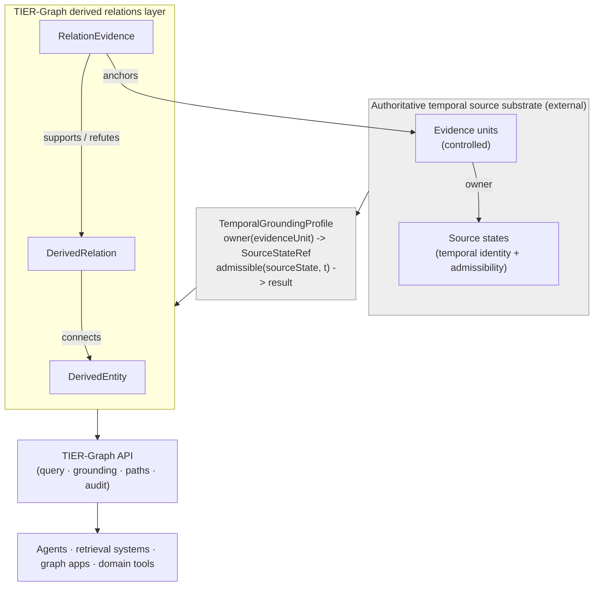

# TIER-Graph API Specification

[](./LICENSE)
[](./openapi/openapi.yaml)
[](./schemas)
[](./CHANGELOG.md)
[](./.github/workflows/validate-specification.yml)

**TIER-Graph** — **T**emporally **I**ndexed **E**vidence-**L**inked **R**elations Graph.

This repository contains the official, **implementation-neutral** specification for the
**TIER-Graph API**: a domain-independent contract for publishing, querying, and auditing
*derived relational propositions* whose evidence is linked to **externally controlled
temporal source states**.

> **Status:** This is a **formal specification**, not a reference implementation.
> It defines a public interaction contract, canonical data models, temporal semantics,
> and the **normative** conformance definitions. It contains **no production server, no
> private source database, and no executable conformance fixtures**.
> See [§ No production data](#-no-production-data-included).

The specification defines a **generic** contract for temporally grounded, evidence-linked
derived relations. It does **not** depend on any concrete substrate: a concrete substrate
couples to the core **only** through a `TemporalGroundingProfile`.

### Two repositories: define vs. execute

| Repository | Role |
| ---------- | ---- |
| **`tier-graph-api`** (this repo) | **Defines** the contract: prose, OpenAPI, schemas, ontology, generic profile guidance, and the **normative** conformance definitions. |
| [**`tier-graph-reference`**](https://github.com/hmartim/tier-graph-reference) | **Executes** the contract: a fixture-backed grounding provider, the executable T01–T10 payloads, a conformance runner, an optional SAT-Graph adapter, and an optional reference service. |

The dependency direction is strictly **`tier-graph-reference` → `tier-graph-api`**, never
the reverse. This repository never gains executable payloads or a concrete substrate
adapter; the reference implementation never redefines normative semantics.

> **Non-normative note.** A concrete legal grounding profile over a versioned legal-norms
> substrate (as demonstrated with the [SAT-Graph](https://arxiv.org/abs/2510.06002) knowledge
> graph) is **one possible instantiation** of this contract. It lives in `tier-graph-reference`
> and is **not** part of, nor required by, this specification.

---

## What problem does TIER-Graph solve?

Knowledge graphs built from extracted or curated relations face three recurring failures
when they are used for high-stakes, auditable retrieval:

- **Evidence is flattened.** A relation is asserted, but *which units of source jointly
  support it* — and whether they *jointly* or *alternatively* support it — is lost.
- **Truth is treated as timeless.** A relation that held under one version of its source
  substrate is projected onto every point in time, producing anachronistic answers.
- **Provenance is conflated with truth.** Extraction confidence, reviewer disagreement,
  and proposition polarity get collapsed into a single "score."

TIER-Graph addresses these by separating **three ontological objects** and grounding their
temporality in an **external, authoritative source substrate** through a declared profile.

## The three-object ontological core

```text
DerivedEntity  --predicate-->  DerivedEntity        (a DerivedRelation)
                     ^
                     | supported / refuted by
                     |
              RelationEvidence  --anchors-->  EvidenceUnitRef  (external, controlled)
```

1. **`DerivedEntity`** — a normalized referent (concept, actor, event, duty, …) identified
   by an **opaque** identifier. Labels never define identity.
2. **`DerivedRelation`** — a normalized, qualified, **defeasible** proposition connecting
   two entities: `⟨source, predicate, target, polarity, qualifiers⟩`. Polarity is part of
   the identity key, not of evidence stance: *"X does not cause Y"* is a different
   proposition from *"X causes Y"*, not a refutation of it.
3. **`RelationEvidence`** — a record that one **non-empty set** of external evidence units
   *jointly* supports or refutes one relation.

Everything temporal — *"was this relation supported at time t?"* — is computed from
evidence admissibility, which is resolved by an external **`TemporalGroundingProfile`**.
TIER-Graph **never copies** authoritative source-state intervals into a relation.

## Architecture: core vs. grounding profile



- The **TIER-Graph core** (entities, relations, evidence, qualifiers, provenance, review)
  is domain-independent and knows nothing about "laws", "versions", or "articles".
- A **grounding profile** declares how *this* implementation resolves an external evidence
  unit to the temporal state that controls it, and what "admissible at time *t*" means.
- The profile is **authoritative** for the source properties it controls; TIER-Graph
  derived relations are **defeasible** and never automatically domain truth.

### Profiles are the only coupling point

A concrete substrate meets the core **only** through a `TemporalGroundingProfile`. Any
controlled temporal substrate can satisfy the contract — versioned legislation, clinical
records, scientific records, financial datasets, corporate documents — with the same abstract
roles:

| Abstract role (core) | Instantiated by a profile as… |
| -------------------- | ----------------------------- |
| `EvidenceUnitRef` | a reference to a controlled unit of evidence (e.g. a document fragment) |
| `SourceStateRef` | a reference to the state that owns it (e.g. a document version) |
| `owner(evidenceUnit)` | the profile's resolution of a unit to its owning source state |
| `admissible(sourceState, t)` | the profile's authoritative temporal admissibility decision |

The core knows **none** of the substrate's concrete classes, endpoints, schemas, or
namespaces. A worked legal instantiation lives in `tier-graph-reference` (non-normative); see
[`spec/05`](./spec/05-temporal-grounding-contract.md) to author your own.

---

## Repository layout

```text
tier-graph-api/
├── spec/            Normative conceptual specification (Markdown, RFC 2119 language)
├── openapi/         Machine-readable API contract (OpenAPI 3.1.0, modular + bundler)
├── schemas/         Machine-readable data models (JSON Schema 2020-12)
├── ontology/        Lightweight RDF/OWL vocabulary (Turtle) + SHACL constraints
├── profiles/        Generic vocabulary + grounding-profile templates, authoring guide
├── examples/        Synthetic example instances (validate against schemas)
├── conformance/     Normative conformance definitions T01–T10 (no executable payloads)
└── scripts/         Validation tooling (no service implementation)
```

## Specification documents

The normative prose lives in [`spec/`](./spec/):

| Doc | Title |
| --- | ----- |
| [00](./spec/00-overview.md) | Overview |
| [01](./spec/01-architecture.md) | Architecture |
| [02](./spec/02-core-ontology.md) | Core ontology (the three objects) |
| [03](./spec/03-relation-identity.md) | Relation identity & merge rules |
| [04](./spec/04-evidence-semantics.md) | Evidence semantics (conjunctive vs. alternative, stance) |
| [05](./spec/05-temporal-grounding-contract.md) | Temporal grounding contract |
| [06](./spec/06-evidential-state-and-policies.md) | Evidential state & admission policies |
| [07](./spec/07-api-primitives.md) | API primitives |
| [08](./spec/08-paths-and-temporal-topology.md) | Paths & temporal topology |
| [09](./spec/09-provenance-and-review.md) | Provenance & review |
| [10](./spec/10-conformance.md) | Conformance |
| [11](./spec/11-extension-points.md) | Extension points |
| [12](./spec/12-security-and-privacy.md) | Security & privacy |
| [13](./spec/13-versioning-and-compatibility.md) | Versioning & compatibility |

## Conformance classes

An implementation may claim one or more of the following (see
[`spec/10-conformance.md`](./spec/10-conformance.md)):

1. **Core Model Conformance** — the three objects, opaque identifiers, qualifier-status
   semantics, evidence-set semantics, stance semantics, provenance/lifecycle separation.
2. **Temporal Grounding Conformance** — a declared profile, deterministic/authoritative
   `owner` resolution, admissibility evaluation, no copied intervals, computed state.
3. **Query API Conformance** — entity/relation/evidence lookup, reverse evidence lookup,
   relation state at time, relation history, projected relations.
4. **Path Conformance** — paths generated over a *time-indexed projection*, step-level
   grounding, exclusion explanations, **no post-hoc-only temporal filtering**.
5. **Authoring Conformance** *(optional)* — creation of core objects, duplicate-evidence
   detection, conservative identity handling, auditable review transitions.
6. **Analytical Extension Conformance** *(optional)* — temporal compatibility for
   communities, summaries, and gates.

A read-only implementation may claim **Query Conformance** without implementing authoring.

## Implementing the API over your own domain

TIER-Graph is domain-independent. To implement it:

1. Model your referents as `DerivedEntity` and your propositions as `DerivedRelation`.
2. Attach `RelationEvidence` records, each anchoring one or more externally controlled
   evidence units (`EvidenceUnitRef`).
3. Declare a **`ProfileVocabulary`**: the entity types, predicates, predicate families, and
   qualifier dimensions of *your* domain, and which dimensions are identity-relevant. The
   core fixes none of these.
4. Provide a **`TemporalGroundingProfile`** that implements `owner(evidenceUnit)` and
   `admissible(sourceState, t)` over *your* source substrate.
5. Expose the required query and grounding primitives from the OpenAPI contract.

Steps 3 and 4 are separate documents on purpose: the vocabulary fixes meaning and identity,
the grounding profile fixes temporal authority, and each is versioned on its own. Start from
[`profiles/generic/vocabulary-template.yaml`](./profiles/generic/vocabulary-template.yaml)
and [`profiles/generic/profile-template.yaml`](./profiles/generic/profile-template.yaml),
then read [`spec/05-temporal-grounding-contract.md`](./spec/05-temporal-grounding-contract.md).

## Validation

```bash
cd openapi && npm install     # install swagger-cli + js-yaml
npm run validate              # validate the modular OpenAPI contract
npm run bundle                # produce openapi-bundled.yaml (gitignored)

# from repo root:
npm --prefix scripts install
npm --prefix scripts run validate:schemas       # JSON Schema 2020-12 (ajv)
npm --prefix scripts run validate:examples      # example instances
npm --prefix scripts run validate:profiles      # vocabulary/profile docs + token uniqueness
npm --prefix scripts run validate:conformance   # conformance defs + no executable payloads
npm --prefix scripts run guard:private          # reject private/database artifacts
```

## 🔒 No production data included

This repository contains **only** interface definitions, data models, documentation,
synthetic examples, and the **normative** conformance definitions. It **MUST NOT** contain:

- any private source database (`*.db`, `*.sqlite`, `*.parquet`, …);
- production credentials, `.env` files, or secrets;
- a complete hosted service or proprietary ingestion/curation pipeline;
- model weights or confidential source documents;
- executable conformance payloads (`input.json`, `profile-fixture.json`, `request.json`,
  `expected.json`) — these live in `tier-graph-reference`.

Executable fixtures and any concrete profile adapter are published separately in
`tier-graph-reference` as **minimal, test-specific** artifacts, never a production substrate.
A CI guard rejects any commit that introduces a private-artifact pattern.

## Citation

See [`CITATION.cff`](./CITATION.cff). Once the draft is tagged (`v0.1.0-draft`), cite the
archived release.

## License

[MIT](./LICENSE) © Hudson de Martim and contributors.
