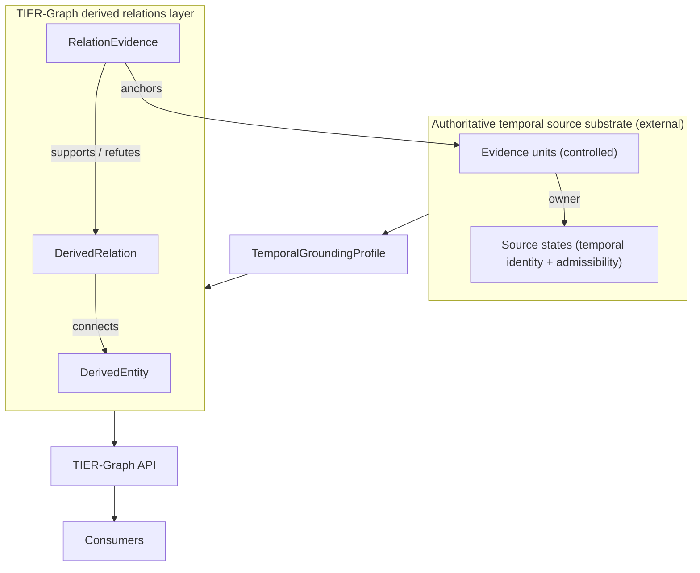

# 01 — Architecture

## The architectural boundary

TIER-Graph MUST remain independent of any single source substrate. The generic
architecture is layered:

```text
Controlled temporal source substrate      (external, authoritative)
        │
        │  TemporalGroundingProfile
        ▼
TIER-Graph derived relations layer         (the ontological core)
        │
        │  TIER-Graph API
        ▼
Agents · retrieval systems · graph applications · domain tools
```

- The **source substrate** owns the identity of evidence units and source states, and
  decides temporal admissibility. It is authoritative *only* for what it explicitly
  controls.
- The **grounding profile** is the narrow, declared interface between the substrate and
  the core. It provides `owner(evidenceUnit)` and `admissible(sourceState, t)`.
- The **derived relations layer** — entities, relations, evidence, qualifiers, provenance,
  review — is the ontological core. It is domain-independent and defeasible.
- The **API** is the public contract exposing query, grounding, path, and audit primitives.

## Separation of authority

Two kinds of assertions coexist and MUST NOT be conflated:

| | Authoritative source properties | Derived propositions |
| --- | --- | --- |
| Owner | The source substrate (via profile) | The TIER-Graph layer |
| Examples | source-state identity, temporal admissibility, formal transitions | relations, qualifiers, evidence bases, evidential state |
| Status | authoritative for what it controls | defeasible; never automatically domain truth |
| Temporal semantics | defined by the profile | *computed* from evidence admissibility |

The core **MUST NOT** override a profile's admissibility decision, and **MUST NOT** copy a
source-state interval onto a `DerivedRelation`.

## Profiles are the only coupling point

A concrete substrate meets the core **only** through a `TemporalGroundingProfile`. The core
knows only the abstract roles `EvidenceUnitRef`, `SourceStateRef`, and the profile's two
functions (`owner`, `admissible`) — never any substrate's classes, endpoints, schemas, or
namespaces. See [05 — Temporal Grounding Profile Specification](./05-temporal-grounding-contract.md).

> **Non-normative note.** A concrete legal grounding profile over a versioned legal-norms
> substrate — one possible instantiation of this contract — is demonstrated in the separate
> **`tier-graph-reference`** project (as a profile mapping plus an executable adapter). It is
> **not** part of, nor required by, this specification. Equally valid substrates include
> clinical records, scientific records, financial datasets, or corporate documents, none of
> which the core knows about.

## Layered diagram



## What lives where

| Concern | Location |
| ------- | -------- |
| Ontological core objects & invariants | `spec/02`–`spec/04`, `schemas/core`, `ontology/` |
| Temporal grounding contract | `spec/05`, `schemas/grounding`, `profiles/generic/` |
| Evidential state & policies | `spec/06`, `schemas/grounding`, `schemas/query` |
| API primitives & paths | `spec/07`–`spec/08`, `openapi/` |
| Generic profile template & authoring guide | `profiles/generic/` |
| Conformance definitions (normative) | `spec/10`, `conformance/` |
| Concrete reference profile & fixtures (non-normative) | `tier-graph-reference` (separate repo) |

## Non-goals

- No production server or reference implementation lives in this repository.
- No private source database, credentials, or production configuration is included.
- The core does not attempt to be a complete logical representation of every proposition
  (see [03 — Relation identity](./03-relation-identity.md) on binary topology).
